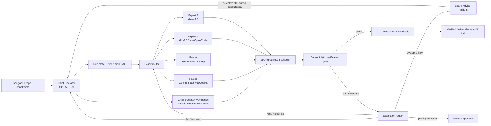

# Fusion MetaLoop Swarm
## Board Advisor + Chief Operator + Tiered Labor Architecture

**Status:** Integration design / implementation outline  
**Target:** `fusion.zip` Codex plugin  
**Recommended mode name:** `metaloop`  
**Recommended user-facing label:** **MetaLoop — Board Advisor + Tiered Swarm**

---

## 1. Executive recommendation

Add this as a **new, explicit swarm option** rather than modifying `ultraswarm` in place.

`ultraswarm` is currently a largely symmetrical council-and-delegation mode: every external participant first receives the same framing questions, then Codex assigns one task per agent and integrates the outputs. The requested design is materially different:

- **GPT-5.6 is the Chief Operator**, not merely a judge after a council.
- **Fable 5 is an asymmetric Board Advisor**, not another worker or equal-vote panelist.
- Workers are divided into **expert** and **fast** labor tiers.
- Routing is dynamic and risk-aware rather than round-robin or one-task-per-agent.
- GPT retains personally important, high-risk, and cross-cutting work.
- Failures escalate through explicit tiers and bounded repair loops.
- Deterministic tests and acceptance gates outrank model agreement.

The right architecture is therefore a **centralized plan-and-execute system with an on-demand critic**, not a free-form multi-agent group chat.

### Recommended operating model

| Plane | Role | Model / harness | Primary responsibility |
|---|---|---|---|
| Host plane | Chief Operator | GPT-5.6 Sol in Codex | Plan, decompose, route, own critical work, integrate, verify, synthesize, escalate |
| Advisor plane | Board Advisor | Fable 5 via Claude Code print mode | Strategy critique, decomposition review, risk spotting, architecture/taste, stop-or-revise guidance |
| Expert labor | Expert A | Grok 4.5 via Grok Build | Novel diagnosis, adversarial edge cases, current-context research, alternative architectures |
| Expert labor | Expert B | GLM 5.2 via OpenCode | Repo-scale analysis, complex implementation, broad refactors, deep review |
| Fast labor | Fast A | Gemini 3.5 Flash via Antigravity CLI (`agy`) | Fast scouting, inventory, mechanical edits, scaffolding, batch work |
| Fast labor | Fast B | Gemini 3.5 Flash via Copilot CLI | Focused edits, tests, documentation, diff inspection, small bounded fixes |
| Control plane | Deterministic runtime | Fusion Python + bash adapters | Run state, DAG, schemas, budgets, retries, receipts, gates, workspace isolation |

### The single most important design constraint

**Fable does not sit in the hot path of every subtask.** It is consulted when its premium judgment is likely to change the plan, avoid a serious mistake, or resolve a systemic failure. GPT remains accountable for the run and records whether it adopted or overrode Fable's advice.

---

## 2. Repo-grounded starting point

The attached Fusion checkout already contains most of the infrastructure needed:

- Codex is the active host, conductor, judge, and synthesizer in `CODEX.md`.
- External models are dispatched through `scripts/providers/*.sh`.
- Provider calls share timeout, scratch-directory, output-cleaning, and exit-code behavior in `scripts/providers/_common.sh`.
- The stdlib Python engine lives in `python/fusion_swarm/`.
- `python/fusion_swarm/hierarchical.py` already demonstrates director → subtask → worker → synthesis, but only with a small numbered plan and round-robin assignment.
- `skills/fusion-ultraswarm/SKILL.md` already demonstrates a host-led council, agent assignment, external dispatch, integration, and verification.
- `tests/validate.sh` checks shell syntax, JSON, skill/command metadata, prompt invariants, and Python compilation.
- `tests/smoke-providers.sh` performs live one-word provider checks.
- `scripts/ledger.sh` records provider reliability and mode history.

### Gaps between the current repo and MetaLoop

| Current behavior | MetaLoop requirement | Required change |
|---|---|---|
| Flat external panel roster | Asymmetric advisor + tiered workers | Separate advisor registry from worker lanes |
| `hierarchical.py` round-robin assignment | Risk-, complexity-, context-, and latency-aware routing | Add typed `TaskSpec` and policy router |
| Generic text worker outputs | Structured artifacts, evidence, checks, confidence, blockers | Add JSON schemas and schema validation |
| Scratch dirs prevent repo writes | Safe proposal mode plus opt-in isolated worktrees | Add workspace strategy abstraction |
| All failures are mostly adapter return codes | Failure taxonomy and escalation state machine | Add retry, promotion, takeover, advisor, and stop states |
| UltraSwarm opens with equal council questions | GPT plans first; Fable critiques selectively | New skill and control flow |
| Provider strengths currently treat OpenCode as a speed worker | GLM/OpenCode must be in expert tier | Update provider capability metadata |
| Copilot and Agy use the same base Gemini model | They must not count as two independent model-family votes | Correlation-aware consensus and ledger fields |
| Basic run ledger | Advisor decisions, tier routes, gate evidence, attempts, cost/latency | Extend run record schema |
| README retains legacy Claude-oriented wording | New mode needs Codex-native documentation | Update active docs and clearly label legacy text |

---

## 3. Goals and non-goals

### Goals

1. Improve large coding and research outcomes through **deliberate division of labor**.
2. Reserve the strongest and most expensive judgment for situations where it matters.
3. Keep GPT-5.6 accountable as the single owner of planning, scope, integration, and final correctness.
4. Make Fable 5 a high-leverage critic without creating a second competing orchestrator.
5. Use expert workers for difficult or ambiguous subtasks and fast workers for bounded throughput tasks.
6. Make every handoff explicit, typed, auditable, and independently verifiable.
7. Keep loops bounded by call count, repair count, time, and budget.
8. Preserve Fusion's existing invariants: real dispatch only, absent is not agreement, and observable verification beats model opinion.
9. Work safely in coding repositories without allowing multiple agents to corrupt one checkout.
10. Degrade gracefully when one or more CLIs are unavailable.

### Non-goals

- No unbounded agent-to-agent conversation.
- No all-to-all shared chat room.
- No assumption that more agents automatically means higher quality.
- No automatic acceptance of advisor feedback.
- No model vote overriding a failing test.
- No simultaneous writes to the same checkout.
- No silent substitution of a different model when a requested model is unavailable.
- No treating the two Gemini 3.5 Flash harnesses as independent epistemic votes.
- No direct production, destructive, paid-large, or irreversible action without human approval.
- No claim that the mode is complete when the verification gate did not run or did not pass.

---

## 4. Top-level architecture

The complete diagram is in `diagrams/01_metaloop_architecture.svg`.



### Three-plane separation

#### Host plane

The host plane is where judgment and accountability live. GPT-5.6:

- interprets the user's actual goal;
- inspects the real repository and constraints;
- forms the primary plan;
- decides what it must keep for itself;
- delegates only tasks with explicit contracts;
- integrates work into one coherent result;
- runs or interprets deterministic verification;
- decides whether Fable advice is adopted;
- decides when the system must stop instead of bluffing.

#### Advisor plane

The advisor plane is lateral. Fable:

- sees the goal, context summary, plan, risk profile, and selected evidence;
- does **not** own the task DAG;
- does **not** assign workers directly;
- does **not** write to the user's repository;
- does **not** call side-effect tools;
- does **not** approve its own implementation work;
- returns a concise, structured memo to GPT.

#### Control and labor plane

The control plane is deterministic Python and shell code. It handles:

- run IDs and task IDs;
- task schemas and output schemas;
- dependency waves;
- concurrency;
- timeout and retry accounting;
- provider availability;
- workspace strategy;
- artifact and receipt persistence;
- gate execution;
- escalation state transitions;
- ledger recording.

The labor plane performs scoped work but never owns the final result.

---

## 5. Chief Operator specification — GPT-5.6

### Mission

Own the outcome from intake through verified delivery. Use the rest of the system as leverage, not as a substitute for judgment.

### Responsibilities

#### A. Intake and framing

- Restate the actual outcome in one sentence.
- Identify success criteria, hard constraints, and approval boundaries.
- Inspect the repository before inventing paths, scripts, APIs, or schemas.
- Classify the work by category, risk, complexity, context size, reversibility, and latency sensitivity.
- Determine whether the work is decomposable without creating coordination overhead.

#### B. Plan construction

- Build a task DAG rather than an unordered list.
- Define an artifact contract and verification command for each delegated task.
- Identify interfaces between subtasks before dispatch.
- Mark critical-path tasks that GPT retains.
- Define fallback chains before workers start.
- Freeze a base commit or context snapshot so workers reason from the same starting point.

#### C. High-level labor GPT must retain

By default, GPT personally handles:

- authentication and authorization changes;
- security-sensitive behavior;
- database migrations and persistent data repair;
- public API contracts and cross-service schemas;
- architecture spanning multiple subsystems;
- financial, legal, compliance, or production-sensitive logic;
- merge conflict resolution;
- final end-to-end integration;
- final user-facing explanation and caveats.

GPT may ask experts to analyze or challenge these tasks, but it remains the implementing owner unless the user explicitly permits otherwise.

#### D. Delegation

- Delegate the narrowest meaningful unit of work.
- Never ask two workers to make overlapping edits unless the comparison is intentional.
- Provide exact allowed paths, forbidden paths, inputs, outputs, and checks.
- Route based on task properties, not equal workload distribution.
- Prefer fast workers only when the work is bounded and easy to verify.
- Prefer expert workers when ambiguity, novelty, context, or blast radius is high.

#### E. Verification and synthesis

- Treat model output as untrusted.
- Validate structure before considering content.
- Run deterministic checks wherever possible.
- Compare worker claims against actual artifacts and test results.
- Reconcile disagreements explicitly.
- Never report success because multiple agents agree if tests fail or evidence is missing.

#### F. Escalation

- Promote failed fast work to the expert tier.
- Take over expert work that affects integration or conflicts with another expert.
- Consult Fable for systemic plan, architecture, risk, or taste failures.
- Stop after bounded repair rounds and report blockers honestly.

### Chief Operator output contract

At the end of a run, GPT should report:

1. **Outcome** — what was delivered.
2. **Plan summary** — key decomposition decisions.
3. **Work allocation** — which tasks each model/harness handled.
4. **Advisor influence** — what Fable recommended and whether GPT adopted it.
5. **Verification** — exact commands and pass/fail results.
6. **Known limitations** — partial or unverified areas.
7. **Audit** — model IDs, attempts, absent workers, fallbacks, and workspace mode.

---

## 6. Board Advisor specification — Fable 5

### Mission

Improve strategy and judgment without taking operational control.

### Fable's proper use cases

Consult Fable before execution when one or more of these are true:

- the task is high-risk or hard to reverse;
- the plan spans several subsystems;
- requirements are ambiguous and a wrong interpretation would be costly;
- the decomposition may hide cross-task coupling;
- architectural taste or long-term maintainability matters more than raw throughput;
- the user asks for a premium second opinion;
- GPT's plan confidence is below the configured threshold.

Consult Fable during execution when:

- two expert outputs conflict on architecture or root cause;
- two repair attempts fail for the same class of reason;
- the gate failure suggests the plan, not the implementation, is wrong;
- scope is expanding unexpectedly;
- a worker finds evidence that invalidates a core assumption;
- GPT suspects local optimization is damaging the overall design.

Consult Fable near completion only when:

- the run is high-risk;
- the result is taste-sensitive or architecture-heavy;
- a consequential tradeoff remains unresolved;
- the user requested a final premium review.

### Fable must not be used for

- routine lint fixes;
- simple documentation edits;
- repetitive file transformations;
- every worker result;
- ordinary test failures with a clear local cause;
- acting as a third implementation worker;
- breaking ties by reputation alone.

### Advisor call budget

Recommended defaults:

- `advisor_policy=auto`
- `max_advisor_calls=2`
- one preflight call when triggered;
- one systemic or final review call when triggered;
- absolute hard cap of 3 for explicitly high-stakes runs.

### Advisor input packet

Fable receives a compact packet, not the entire raw conversation by default:

```json
{
  "run_id": "ml_20260710_001",
  "consult_reason": "high_risk_preflight",
  "user_goal": "...",
  "constraints": ["..."],
  "repo_snapshot": {
    "base_commit": "abc123",
    "relevant_paths": ["src/..."],
    "test_commands": ["npm test"]
  },
  "risk_profile": {
    "level": "high",
    "reversibility": "medium",
    "blast_radius": "cross_subsystem"
  },
  "plan_version": 1,
  "plan": {"tasks": []},
  "open_questions": ["..."],
  "evidence": ["..."]
}
```

### Advisor output schema

```json
{
  "decision": "approve | revise | stop",
  "plan_version": 1,
  "consult_reason": "high_risk_preflight",
  "risk_findings": [
    {
      "severity": "high",
      "finding": "...",
      "evidence": "...",
      "consequence": "..."
    }
  ],
  "decomposition_findings": ["..."],
  "missing_evidence": ["..."],
  "required_changes": ["..."],
  "optional_taste_notes": ["..."],
  "confidence": 0.84
}
```

### Adoption rule

GPT must process every `required_changes` item and record one of:

- `adopted`;
- `partially_adopted` with explanation;
- `overridden` with evidence and rationale;
- `blocked` because required context or capability was unavailable.

This prevents the advisor from becoming ceremonial while preserving GPT's final authority.

### Recommended Fable adapter behavior

Create `scripts/providers/fable.sh` using Claude Code print mode with:

- a pinned Fable model;
- no persistence;
- no side-effect tools;
- no MCP tools;
- a JSON schema for the advisor memo;
- a strict timeout and per-call budget;
- the same exit-code contract as existing Fusion adapters.

Use a direct Fable call with an advisor-role system prompt. Do **not** launch another Claude model merely to call its internal advisor tool, because that inserts an unnecessary orchestration layer between GPT and Fable.

---

## 7. Expert labor layer

### Expert A — Grok 4.5 via Grok Build

Best suited for:

- unusual bug hypotheses;
- adversarial edge-case discovery;
- alternative architecture proposals;
- current external context or research when permitted;
- broad challenge of an existing assumption;
- independent review of a difficult design;
- finding failure modes the primary plan underweights.

Avoid routing Grok:

- purely repetitive transformations;
- highly coupled edits without an isolated worktree;
- final integration ownership;
- tasks where current web context adds no value and another worker is more direct.

Expected artifact styles:

- root-cause memo;
- risk register;
- alternative design with tradeoffs;
- scoped patch or worktree commit;
- adversarial test plan;
- evidence register.

### Expert B — GLM 5.2 via OpenCode

Best suited for:

- reading large portions of a repository;
- complex implementation with multiple related files;
- broad but bounded refactors;
- interface mapping and code archaeology;
- producing a comprehensive candidate patch;
- deep review against an explicit specification;
- tasks that benefit from long, coherent coding context.

Avoid routing GLM/OpenCode:

- tiny tasks where startup and context cost exceed the work;
- final merge ownership;
- overlapping writes with another worker;
- security-sensitive decisions without GPT review.

Expected artifact styles:

- implementation patch;
- repository map;
- interface contract analysis;
- refactor plan plus code;
- test additions;
- migration impact analysis.

### Expert selection policy

| Signal | Prefer Grok 4.5 | Prefer GLM 5.2/OpenCode |
|---|---:|---:|
| Novel hypothesis / contrarian diagnosis | Strong | Medium |
| Current external context | Strong | Low unless tools configured |
| Adversarial edge cases | Strong | Medium |
| Large repository context | Medium | Strong |
| Multi-file implementation | Medium | Strong |
| Broad refactor | Medium | Strong |
| Architecture alternatives | Strong | Strong |
| Precise candidate patch | Medium | Strong |
| Independent critique | Strong | Strong |

For especially difficult tasks, one expert may produce and the other may challenge, but this should be explicit rather than automatic.

---

## 8. Fast labor layer

### Fast A — Gemini 3.5 Flash via Antigravity CLI (`agy`)

Best suited for:

- repository inventory;
- locating files, symbols, and call paths;
- straightforward scaffolding;
- repetitive mechanical edits;
- batch extraction and classification;
- simple tests from an existing pattern;
- formatting and documentation cleanup;
- isolated low-risk implementation cells.

### Fast B — Gemini 3.5 Flash via Copilot CLI

Best suited for:

- focused code edits;
- generating or extending unit tests;
- documentation and comments tied to code;
- reviewing a small diff against criteria;
- simple bug fixes with a known root cause;
- completing stubs from a frozen contract;
- checking consistency across a bounded file set.

### Correlated-model rule

Both fast workers use Gemini 3.5 Flash. Their different harnesses can create useful **execution diversity**—different context collection, tools, prompts, and environment behavior—but they are not two independent model-family opinions.

Therefore:

- never call their agreement “two-model consensus”;
- in model-family voting, count them as one Gemini family or weight each at `0.5`;
- use them primarily to increase throughput or compare harness behavior;
- do not randomly assign duplicate subtasks solely to create fake confidence;
- store both `model_family` and `harness` in the ledger.

### Fast-lane promotion rule

Promote to the expert lane when any of these occur:

- output schema fails twice;
- local verification fails after one repair;
- worker confidence is below the threshold;
- the worker identifies hidden cross-cutting scope;
- the task requires changing an interface not included in its contract;
- the root cause remains uncertain;
- the produced patch touches forbidden or unapproved paths.

---

## 9. Routing policy

The full routing diagram is in `diagrams/02_metaloop_routing.svg`.

### Hard overrides first

Hard overrides always beat learned provider preferences or heuristic scores.

#### Route to GPT Chief Operator

- authentication / authorization;
- secrets and credential handling;
- database migration or destructive data repair;
- payments, billing, financial calculations, or legal/compliance boundaries;
- public API or data contract changes;
- cross-cutting architecture;
- production configuration;
- merge conflict resolution;
- final integration.

For high-risk items in this group, trigger a Fable preflight.

#### Route to expert tier

- high complexity;
- high novelty;
- high ambiguity;
- large context requirement;
- broad blast radius;
- difficult root-cause analysis;
- architecture or design tradeoff;
- fast-tier promotion.

#### Route to fast tier

- low risk;
- specific and well bounded;
- repetitive or mechanical;
- easy to verify automatically;
- latency sensitive;
- no cross-task interface ownership;
- small allowed-path set.

### Heuristic score after hard overrides

A simple v1 score can make the decision auditable:

```text
expert_pressure =
    2 * risk
  + 2 * complexity
  + context_size
  + novelty
  + ambiguity
  + blast_radius
  - latency_priority
  - verification_strength
```

Suggested normalized values: `0..3` per dimension.

- `expert_pressure >= 8` → expert lane.
- `expert_pressure <= 3` and `risk <= 1` → fast lane.
- otherwise → GPT chooses using provider strengths, current availability, and ledger evidence.

This score is not an ML model. It is a transparent routing aid with explicit overrides.

### Provider fallback chains

```text
Fast task:
  agy → copilot → selected expert → GPT
or
  copilot → agy → selected expert → GPT

Repo-scale implementation:
  opencode → GPT → grok crosscheck when needed

Novel diagnosis / current-context task:
  grok → GPT → opencode implementation

Systemic plan failure:
  GPT → Fable memo → revised GPT plan
```

Never silently replace the requested model. Every fallback must be recorded.

---

## 10. Task decomposition contract

### TaskSpec

Every delegated task should be serialized before dispatch.

```json
{
  "id": "T-04",
  "objective": "Add unit coverage for the new route policy",
  "category": "test_implementation",
  "complexity": 1,
  "risk": 1,
  "novelty": 0,
  "ambiguity": 0,
  "latency_priority": 3,
  "context_size": 1,
  "blast_radius": 1,
  "tool_needs": ["read", "edit", "test"],
  "dependencies": ["T-02"],
  "allowed_paths": [
    "tests/",
    "python/fusion_swarm/"
  ],
  "forbidden_paths": [
    ".codex-plugin/plugin.json"
  ],
  "acceptance_criteria": [
    "Covers fast-to-expert promotion",
    "Covers advisor escalation",
    "Does not require network access"
  ],
  "verification_cmd": "python -m unittest tests.test_metaloop",
  "preferred_tier": "fast",
  "preferred_provider": "copilot",
  "fallback_chain": ["agy", "opencode", "host"],
  "artifact_contract": {
    "type": "patch_or_commit",
    "required_files": ["tests/test_metaloop.py"]
  },
  "approval_level": "none"
}
```

### Decomposition rules

A valid task cell must:

- have one objective;
- have a bounded path set;
- own no interface another parallel task is modifying;
- have explicit dependencies;
- produce a named artifact;
- have acceptance criteria;
- have a verification method;
- identify whether it can write, propose only, or requires approval;
- be small enough to retry without replaying the entire run.

### Bad decomposition examples

- “Implement the backend” — too broad.
- “Review everything” — no bounded artifact.
- Two agents both editing `src/App.tsx` without separate alternatives — overlapping ownership.
- A fast worker changing a database schema because the implementation “needed it” — scope expansion.
- A worker told to “make it better” without measurable acceptance criteria — unverifiable.

---

## 11. Worker handoff and result contracts

### Worker instruction packet

Each worker receives:

1. role and tier;
2. exact `TaskSpec`;
3. minimal context capsule;
4. base commit or snapshot ID;
5. relevant files or worktree path;
6. output JSON schema;
7. stop conditions;
8. verification command it may run;
9. explicit prohibition on expanding scope.

### WorkerResult

```json
{
  "task_id": "T-04",
  "provider": "copilot",
  "model": "gemini-3.5-flash",
  "model_family": "gemini",
  "harness": "github-copilot-cli",
  "attempt": 1,
  "status": "returned",
  "summary": "Added route-policy unit coverage.",
  "artifacts": [
    {
      "path": "tests/test_metaloop.py",
      "kind": "modified_file",
      "sha256": "..."
    }
  ],
  "patch": "...",
  "evidence": [
    "Test fails before route promotion is implemented and passes afterward."
  ],
  "checks_run": [
    {
      "command": "python -m unittest tests.test_metaloop",
      "exit_code": 0,
      "output_tail": "OK"
    }
  ],
  "confidence": 0.88,
  "blockers": [],
  "scope_expansion_needed": false,
  "notes_for_integrator": ["..."]
}
```

### Result acceptance rules

A result is eligible for integration only when:

- it parses against the schema;
- `status == returned`;
- required artifacts exist;
- no forbidden path was modified;
- the base commit matches or drift is handled;
- claimed checks have receipts;
- local acceptance criteria pass;
- scope expansion is false or explicitly approved.

A blank, timed-out, malformed, or unavailable worker is **absent**, not negative evidence and not agreement.

---

## 12. Run state and filesystem layout

Recommended state root:

```text
~/.fusion/metaloop/<run_id>/
  run.json
  context/
    repo_snapshot.json
    selected_files.json
  plans/
    plan-v1.json
    advisor-01.json
    plan-v2.json
  tasks/
    T-01/
      spec.json
      prompt.txt
      result-attempt-1.json
      stdout.log
      stderr.log
      artifacts/
    T-02/
      ...
  gates/
    task-T-01.json
    final-gate.json
  integration/
    selected-results.json
    conflict-log.json
    final-summary.md
  audit/
    events.jsonl
    model-usage.json
    approvals.jsonl
```

### Run states

```text
CREATED
→ SNAPSHOTTED
→ PLANNED_V1
→ ADVISOR_REVIEWED (optional)
→ PLANNED_FINAL
→ DISPATCHING
→ COLLECTING
→ REPAIRING (optional, bounded)
→ INTEGRATING
→ FINAL_GATE
→ FINAL_ADVISOR_REVIEW (optional)
→ COMPLETED | PARTIAL | BLOCKED | FAILED | CANCELLED
```

Every state transition should append an event rather than rewriting history.

---

## 13. Execution lifecycle

The full lifecycle diagram is in `diagrams/03_metaloop_lifecycle.svg`.

### Phase 0 — Intake

GPT captures:

- user goal;
- requested deliverable;
- repository or file scope;
- constraints;
- destructive-action policy;
- expected verification;
- whether user explicitly requires all named agents.

### Phase 1 — Context snapshot

The control plane records:

- current working directory;
- git repository status;
- base commit;
- dirty files;
- package manager and scripts;
- relevant paths;
- available providers and exact model IDs;
- current Fusion configuration;
- test/build commands;
- time and call budgets.

No worker is dispatched before this snapshot.

### Phase 2 — GPT plan v1

GPT produces:

- high-level strategy;
- risk profile;
- task DAG;
- task contracts;
- critical-path tasks it owns;
- initial routing;
- approval gates;
- stopping conditions.

### Phase 3 — Fable preflight when triggered

Fable reviews:

- whether the strategy actually reaches the user outcome;
- whether subtasks are independently executable;
- hidden coupling;
- security, data, and production risks;
- missing evidence;
- quality/taste concerns;
- whether the system should stop before acting.

### Phase 4 — GPT plan v2

GPT:

- applies or overrides each required advisor change;
- freezes task contracts;
- computes dependency waves;
- records model routes and fallback chains;
- starts only tasks whose dependencies are satisfied.

### Phase 5 — Parallel labor waves

Within each wave:

- external workers run concurrently up to tier caps;
- GPT performs its own critical task(s) in-context;
- workers use proposal or worktree mode;
- results stream into the run directory;
- no downstream task starts until required upstream artifacts pass local validation.

### Phase 6 — Per-task validation

For each result:

- parse schema;
- confirm artifacts;
- check path constraints;
- run local verification;
- assess evidence and confidence;
- classify failure if not accepted.

### Phase 7 — Bounded repair

Repair order:

1. one schema-repair retry for malformed output;
2. one alternate worker in the same tier for transient or worker-specific failure;
3. fast-to-expert promotion for logic or confidence failure;
4. GPT takeover for expert conflict or integration-sensitive work;
5. Fable consultation for repeated systemic failure;
6. stop at repair cap or budget cap.

Recommended default: `max_repair_rounds=2`.

### Phase 8 — GPT integration

GPT:

- reviews every accepted artifact;
- rejects irrelevant or unsafe output;
- applies proposal-mode patches or reconciles worktree commits;
- resolves conflicts deliberately;
- preserves architecture and scope;
- runs cross-task checks;
- updates user-facing documentation when required.

### Phase 9 — Final deterministic gate

The gate should include the strongest available checks:

- tests;
- typecheck;
- build;
- lint;
- targeted smoke tests;
- diff path restrictions;
- no-secret scan where appropriate;
- user-specified acceptance commands;
- manual structural review where no executable test exists.

### Phase 10 — Optional Fable final review

Fable sees:

- plan and advisor adoption log;
- final diff or artifact summary;
- test receipts;
- unresolved tradeoffs;
- known limitations.

It does not replace the deterministic gate. It checks higher-order judgment and risk.

### Phase 11 — Publish and learn

GPT emits the deliverable and records:

- task routes;
- model and harness IDs;
- attempts and fallbacks;
- advisor calls and decisions;
- gate results;
- latency and cost estimates;
- final outcome;
- whether the run was complete, partial, blocked, or failed.

---

## 14. Workspace safety

The current adapters intentionally run every external panelist in a throwaway scratch directory and never let it touch the user's tree. Preserve that as the safest default.

The full workspace diagram is in `diagrams/04_metaloop_worktrees.svg`.

### Mode A — `proposal` (default for v1)

Workers receive a context capsule and return one or more of:

- structured patch text;
- full replacement file content;
- implementation instructions;
- tests;
- analysis;
- an artifact bundle.

GPT applies selected work in the actual integration checkout and runs verification.

**Advantages:**

- preserves existing Fusion safety;
- easy to implement;
- prevents concurrent corruption;
- keeps GPT in control of every write.

**Limitations:**

- workers cannot independently compile a complete repo change unless the context capsule is sufficient;
- large patches may be cumbersome;
- worker tool use occurs against a scratch copy, not the real checkout.

### Mode B — `worktree` (opt-in for real parallel coding)

The orchestrator:

1. verifies a git repository;
2. freezes a base commit;
3. checks the dirty-tree policy;
4. creates one isolated branch/worktree per write-capable task;
5. dispatches the worker into that worktree;
6. requires a commit or patch plus verification receipts;
7. has GPT cherry-pick or reconcile selected changes into an integration worktree;
8. runs the full gate;
9. cleans temporary worktrees only after artifacts are preserved.

**Never allow several agents to write to one checkout.**

### Dirty-tree policy

Default behavior:

- if the user tree is dirty, use proposal mode;
- worktree mode requires explicit approval or a safe snapshot/stash strategy;
- never auto-stash or discard user work;
- always record the base commit and dirty file list.

---

## 15. Verification design

### Model judgment versus deterministic gates

Use model judgment for:

- ambiguity;
- design tradeoffs;
- architecture;
- synthesis;
- quality and taste;
- evidence interpretation.

Use deterministic checks for:

- compilation;
- tests;
- types;
- lint;
- schema validation;
- file existence;
- changed-path constraints;
- migration syntax;
- generated artifact format;
- command exit codes.

When they disagree, deterministic failure wins.

### GateResult

```json
{
  "gate_id": "final",
  "run_id": "ml_20260710_001",
  "status": "pass | fail | blocked | skipped",
  "commands": [
    {
      "command": "bash tests/validate.sh",
      "exit_code": 0,
      "duration_ms": 981,
      "stdout_tail": "ALL CHECKS PASSED",
      "stderr_tail": ""
    }
  ],
  "acceptance_checks": [
    {
      "criterion": "metaloop is listed as a valid pattern",
      "status": "pass",
      "evidence": "python/fusion_swarm/__main__.py"
    }
  ],
  "changed_paths": ["..."],
  "violations": [],
  "verified_at": "2026-07-10T00:00:00Z"
}
```

### Scope gate

For each task, compare the actual changed paths with `allowed_paths` and `forbidden_paths`. A useful result that modifies an unapproved path is not automatically accepted—it requires GPT review and possibly a new plan version.

---

## 16. Failure taxonomy and escalation

The full state machine is in `diagrams/05_metaloop_escalation.svg`.

### Failure classes

| Class | Examples | Default response |
|---|---|---|
| `provider_absent` | CLI not installed, model unavailable | Use fallback; report absent |
| `timeout` | Worker exceeds wall clock | Retry once on alternate worker |
| `runtime_error` | Auth, quota, CLI crash | Mark degraded; use fallback |
| `malformed_output` | Invalid JSON/schema | One schema-repair retry |
| `scope_violation` | Changed forbidden path | Reject; GPT decides replan |
| `verification_failure` | Test/typecheck/build fails | Same-tier repair or promotion |
| `low_confidence` | Worker flags uncertainty | Promote or cross-check |
| `expert_conflict` | Experts disagree materially | GPT adjudicates; Fable if systemic |
| `plan_failure` | Multiple tasks reveal wrong decomposition | Fable critique; GPT plan vN+1 |
| `budget_exhausted` | Call/time/cost cap reached | Stop spawning; synthesize partial state |
| `approval_required` | Destructive or production action | Pause for human |
| `safeguard_block` | Fable declines or falls back | Record as partial/absent advice; GPT careful mode |

### Degradation behavior

#### Fable unavailable

- continue with GPT in careful mode;
- lower the maximum autonomous risk;
- mark `advisor_status=unavailable`;
- do not claim the run had premium advisor review.

#### One expert unavailable

- use the remaining expert for compatible tasks;
- give GPT any task outside that expert's strengths;
- do not reroute all expert work blindly to a fast worker.

#### Both experts unavailable

- GPT retains difficult work;
- fast workers handle only bounded low-risk tasks;
- reduce parallelism and clearly mark degraded mode.

#### One fast worker unavailable

- use the other fast worker;
- preserve model-family correlation logic;
- avoid duplicating tasks merely to keep worker count constant.

#### Both fast workers unavailable

- use experts only where cost is justified;
- GPT handles remaining small tasks or completes serially.

#### Antigravity adapter mismatch

Because Antigravity CLI is a newer terminal product and is not guaranteed to share Gemini CLI's flags one-for-one:

- detect the actual binary and version;
- parse `agy --help` or a stable machine-readable capability command;
- feature-detect noninteractive prompt, model, cwd, output, and permission flags;
- fail visibly if required capabilities are missing;
- do not reuse Copilot or historical Gemini CLI flags without testing.

#### Fable safeguard fallback

If Fable's safeguards block an advisor request or route it to a fallback model:

- record the actual model used when available;
- mark the memo as `fallback` rather than a Fable memo;
- decide whether GPT can continue safely;
- do not treat the fallback as equivalent premium advice.

---

## 17. Budgets and bounded autonomy

Recommended defaults:

```text
max_advisor_calls       = 2
max_repair_rounds       = 2
max_attempts_per_task   = 3
expert_concurrency      = 2
fast_concurrency        = 2
max_total_external_calls= 12
max_wall_seconds        = 1800
workspace_mode          = proposal
advisor_policy          = auto
human_gate              = destructive|production|paid-large
```

### Call budget example

For a six-task run:

- 1 Fable preflight;
- 2 expert tasks;
- 3 fast tasks;
- 1 fast alternate;
- 1 expert promotion;
- optional 1 Fable final review;

Total external calls: 9. GPT host reasoning is tracked separately if the host exposes usage.

### Stop conditions

Stop rather than spawning more work when:

- the same acceptance criterion fails after two repair rounds;
- the plan depends on unavailable evidence;
- a required privileged action is not approved;
- the integration gate reveals a design-level flaw after advisor revision;
- the call, cost, or time budget is exhausted;
- the user goal cannot be satisfied without expanding scope materially.

---

## 18. Observability and ledger design

### Required event fields

Every event should include:

- `run_id`;
- `task_id` when applicable;
- `timestamp`;
- `event_type`;
- `plan_version`;
- `provider`;
- `model`;
- `model_family`;
- `harness`;
- `tier`;
- `attempt`;
- `status`;
- `duration_ms`;
- `estimated_cost` when available;
- `input_hash` and `output_hash`;
- `workspace_mode`;
- `base_commit`;
- `gate_status`;
- `fallback_from`;
- `consult_reason` for advisor calls.

### Extend `scripts/ledger.sh`

The current ledger hardcodes `codex`, `copilot`, `opencode`, and `grok`. MetaLoop needs either a generic provider iteration or separate records for:

- `fable` advisor;
- `agy` worker;
- model family;
- harness;
- tier;
- route reason;
- gate result;
- advisor adoption rate;
- promotion and takeover counts.

### Metrics worth learning from

- success rate by task category and provider;
- gate pass rate on first attempt;
- fast-to-expert promotion rate;
- average repair rounds;
- advisor recommendation adoption rate;
- runs where Fable changed the plan materially;
- provider timeout/error rate;
- model-family correlation;
- latency and estimated cost per accepted artifact;
- percentage of runs stopped honestly rather than falsely completed.

### Avoid premature auto-routing

Ship `metaloop` as explicit opt-in first. Collect enough run data before changing `scripts/route.sh` to choose it automatically. The route policy should learn from **verified outcomes**, not merely whether a model returned text.

---

## 19. Integration map for `fusion.zip`

### New files

| File | Purpose |
|---|---|
| `skills/fusion-metaloop/SKILL.md` | Host-native MetaLoop control protocol |
| `commands/metaloop.md` | Retained command reference / legacy host compatibility |
| `python/fusion_swarm/metaloop.py` | Run state, routing, dispatch waves, escalation, aggregation metadata |
| `python/fusion_swarm/contracts.py` | Dataclasses, enums, schema validation, serialization |
| `python/fusion_swarm/workspaces.py` | Proposal and worktree strategies |
| `python/fusion_swarm/policy.py` | Hard overrides and transparent route scoring |
| `scripts/providers/fable.sh` | Read-only structured Fable advisor adapter |
| `scripts/providers/agy.sh` | Antigravity CLI fast-worker adapter with capability detection |
| `scripts/metaloop.sh` | Bash-facing helpers for init, dispatch, gate, status, resume |
| `docs/METALOOP.md` | Architecture and operational documentation |
| `tests/test_metaloop.py` | Offline contract, routing, state, and escalation tests |

### Files to modify

| File | Change |
|---|---|
| `python/fusion_swarm/__init__.py` | Export MetaLoop modules |
| `python/fusion_swarm/__main__.py` | Add `metaloop` and its options/subcommands |
| `python/fusion_swarm/adapter.py` | Add Agy; separate advisor registry from worker roster; update strengths |
| `scripts/providers/_common.sh` | Add Fable/Agy config mapping; preserve scratch and exit contract |
| `scripts/providers/detect.sh` | Detect `claude`/Fable capability and `agy`; report exact status |
| `scripts/fusion.sh` | Add dispatch cases for `fable` and `agy`; expose MetaLoop helpers |
| `config/defaults.env` | Add models, policies, budgets, timeouts, workspace mode |
| `skills/fusion-orchestrate/SKILL.md` | Teach conductor that MetaLoop exists and when it may be selected |
| `skills/fusion-orchestrate/references/collaboration-modes.md` | Document MetaLoop semantics |
| `scripts/route.sh` | Do not auto-route in v1; add later after telemetry |
| `scripts/ledger.sh` | Generic provider/model/harness/tier metrics |
| `README.md` | Add MetaLoop table and Codex-native description |
| `CODEX.md` | Add runtime contract and usage examples |
| `CLAUDE.md` | Document adapter and mode maintenance rules if legacy support remains |
| `tests/validate.sh` | Add mode, schema, prompt invariants, and new adapter syntax checks |
| `tests/smoke-providers.sh` | Add optional Fable and Agy live smoke checks |
| `.codex-plugin/plugin.json` | Version, description, keywords, and capability text |

### Important `adapter.py` redesign

Do not simply append Fable to `ALL_PANEL`.

Recommended structure:

```python
WORKER_PROVIDERS = ["copilot", "agy", "opencode", "grok"]
ADVISOR_PROVIDERS = ["fable"]

PROVIDER_META = {
    "grok": {
        "tier": "expert",
        "model_family": "grok",
        "harness": "grok-build",
        "strengths": ["novel_diagnosis", "current_context", "adversarial_review"],
    },
    "opencode": {
        "tier": "expert",
        "model_family": "glm",
        "harness": "opencode",
        "strengths": ["repo_scale", "complex_implementation", "broad_refactor"],
    },
    "agy": {
        "tier": "fast",
        "model_family": "gemini",
        "harness": "antigravity-cli",
        "strengths": ["inventory", "mechanical_edit", "scaffolding", "batch"],
    },
    "copilot": {
        "tier": "fast",
        "model_family": "gemini",
        "harness": "github-copilot-cli",
        "strengths": ["focused_edit", "tests", "docs", "diff_review"],
    },
    "fable": {
        "tier": "advisor",
        "model_family": "claude",
        "harness": "claude-code-print",
        "strengths": ["strategy", "risk", "decomposition", "taste"],
    },
}
```

### Host/runtime split

The Python engine must not pretend it can call the already-running host-native GPT session as a normal subprocess.

Recommended split:

- `fusion-metaloop/SKILL.md` is the **host control program**.
- GPT creates plans, performs critical work, decides routes, and integrates in-context.
- `metaloop.py` is a **state and dispatch engine** for external calls, contracts, workspace setup, and gates.
- Headless mode can later use an external Codex CLI as Chief Operator, but that is a separate execution path and should be labeled clearly.

---

## 20. CLI and configuration design

### User-facing invocation

Natural-language Codex trigger:

```text
Use Fusion MetaLoop for this repository-wide task.
```

Reference command:

```bash
bash "$FUSION_PLUGIN_ROOT/scripts/swarm.sh" metaloop \
  "Implement the requested change" \
  --json \
  --advisor auto \
  --advisor-max 2 \
  --max-repair-rounds 2 \
  --expert-concurrency 2 \
  --fast-concurrency 2 \
  --workspace-mode proposal \
  --gate-cmd "npm test"
```

### Recommended options

```text
--advisor auto|always|on-demand|off
--advisor-max N
--max-repair-rounds N
--max-attempts-per-task N
--expert-concurrency N
--fast-concurrency N
--workspace-mode proposal|worktree
--gate-cmd COMMAND
--budget-calls N
--budget-wall-seconds N
--risk-threshold N
--plan-file PATH
--run-id ID
--resume ID
--json
```

### Recommended environment variables

```bash
# Models
FUSION_FABLE_MODEL="fable"
FUSION_GROK_MODEL="grok-4.5"
FUSION_OPENCODE_MODEL="opencode-go/glm-5.2"
FUSION_AGY_MODEL="gemini-3.5-flash"
FUSION_COPILOT_MODEL="gemini-3.5-flash"

# Effort / variants
FUSION_FABLE_EFFORT="high"
FUSION_OPENCODE_VARIANT="high"
FUSION_GROK_EFFORT=""

# MetaLoop policy
FUSION_META_ADVISOR_POLICY="auto"
FUSION_META_MAX_ADVISOR_CALLS="2"
FUSION_META_MAX_REPAIR_ROUNDS="2"
FUSION_META_MAX_ATTEMPTS_PER_TASK="3"
FUSION_META_EXPERT_CONCURRENCY="2"
FUSION_META_FAST_CONCURRENCY="2"
FUSION_META_WORKSPACE_MODE="proposal"
FUSION_META_MAX_CALLS="12"
FUSION_META_MAX_WALL_SECONDS="1800"

# Timeouts
FUSION_FABLE_TIMEOUT="900"
FUSION_AGY_TIMEOUT="600"
```

### Advisor policy meanings

- `off` — never call Fable.
- `on-demand` — GPT may call only after a detected issue or explicit user request.
- `auto` — policy engine may trigger preflight and one later review.
- `always` — one preflight on every MetaLoop run; still no per-task advisor calls.

---

## 21. Prompt skeletons

These are role contracts, not full user-facing prose.

### GPT Chief Operator skeleton

```text
You are the Chief Operator for a Fusion MetaLoop run.

You own the final outcome. Read the real system before planning. Build a typed task DAG,
keep high-risk and cross-cutting work for yourself, route bounded tasks to the appropriate
labor tier, and use Fable only when premium critique is likely to change the result.

Rules:
- Do not delegate accountability.
- Do not let two workers write overlapping interfaces in parallel.
- Do not accept free text where a structured contract is required.
- Do not treat absent workers as agreement.
- Do not count two Gemini harnesses as two independent model-family votes.
- Deterministic verification outranks model opinion.
- Stop at budget and repair caps.
- Ask for human approval before destructive, production, or paid-large actions.

Final output must include outcome, allocation, advisor influence, verification receipts,
limitations, and audit trail.
```

### Fable Board Advisor skeleton

```text
You are the Board Advisor for a Fusion MetaLoop run.

You are consult-only. You do not implement, dispatch workers, call side-effect tools, or
rewrite the repository. Critique the strategy, decomposition, assumptions, risk controls,
architecture, and quality bar. Look for hidden coupling and missing evidence.

Return only JSON matching AdvisorMemo.
Decision must be exactly: approve, revise, or stop.
Required changes must be specific enough for the Chief Operator to act on.
Do not manufacture certainty. If context is insufficient, list missing evidence.
```

### Expert worker skeleton

```text
You are an expert worker in a centrally orchestrated run.
Complete exactly the supplied TaskSpec. Do not rewrite the plan or expand scope.
Use only allowed paths and tools. Produce the required artifact, run the specified checks,
and return only WorkerResult JSON. If the contract is impossible or unsafe, stop and report
blockers instead of improvising.
```

### Fast worker skeleton

```text
You are a fast execution worker. Optimize for speed on a bounded, low-risk task without
sacrificing correctness. Follow the supplied TaskSpec literally. Do not redesign interfaces,
change unapproved files, or widen scope. Return the requested artifact and WorkerResult JSON.
Escalate uncertainty rather than guessing.
```

---

## 22. Control-flow pseudocode

```python
def run_metaloop(task: str, config: MetaLoopConfig) -> MetaLoopRun:
    run = create_run(task, config)
    run.snapshot = snapshot_context(config.cwd)
    run.providers = detect_capabilities()

    # Host-native GPT performs this step in the skill, then writes plan-v1.json.
    plan = host_create_plan(task, run.snapshot, run.providers, config)
    validate_plan(plan)
    run.save_plan(plan)

    if advisor_policy_triggers(plan, run.snapshot, config):
        memo = call_fable(build_advisor_packet(run, plan))
        validate_advisor_memo(memo)
        plan = host_revise_plan(plan, memo)
        run.record_advisor_adoption(memo, plan)
        validate_plan(plan)

    for wave in topological_waves(plan.tasks):
        host_tasks = [t for t in wave if t.preferred_tier == "host"]
        worker_tasks = [t for t in wave if t.preferred_tier != "host"]

        host_results = host_execute_critical_tasks(host_tasks)
        worker_results = dispatch_wave(worker_tasks, run, config)
        results = host_results + worker_results

        for result in results:
            decision = validate_task_result(result, plan.task(result.task_id), run)
            if decision.pass_:
                run.accept(result)
                continue

            repaired = repair_with_escalation(
                task=plan.task(result.task_id),
                failure=decision.failure,
                run=run,
                config=config,
            )
            if repaired is None:
                return run.stop_partial(decision.failure)
            run.accept(repaired)

    integrated = host_integrate(run.accepted_results, plan, run.snapshot)
    gate = run_final_gate(integrated, config.gate_commands)
    run.record_gate(gate)

    if not gate.passed:
        repaired = host_repair_integration(integrated, gate, run, config)
        if repaired is None:
            return run.stop_partial(gate)
        integrated = repaired

    if final_advisor_policy_triggers(run, plan, config):
        memo = call_fable(build_final_review_packet(run, integrated))
        if memo.decision == "revise":
            integrated = host_apply_final_advice_once(integrated, memo)
            gate = run_final_gate(integrated, config.gate_commands)
        elif memo.decision == "stop":
            return run.block(memo)

    return run.complete(host_publish(integrated, run.audit()))
```

---

## 23. Implementation phases

### Phase 1 — Contracts and explicit proposal-mode MetaLoop

Deliver:

- `contracts.py`;
- `metaloop.py` run state and routing;
- `fable.sh`;
- `agy.sh` with capability detection;
- `fusion-metaloop/SKILL.md`;
- `commands/metaloop.md`;
- proposal-mode dispatch;
- per-task and final gates;
- offline tests;
- ledger extensions;
- explicit opt-in only.

This phase proves the architecture without introducing worktree complexity.

### Phase 2 — Worktree execution

Deliver:

- isolated worktree creation;
- dirty-tree policy;
- task branches;
- commit/patch collection;
- integration worktree;
- conflict log;
- cleanup and recovery;
- worktree-specific tests.

### Phase 3 — Telemetry-informed routing

Deliver:

- provider performance by task category;
- route effectiveness metrics;
- advisor value metrics;
- cost/latency tracking;
- correlation-aware model-family metrics;
- optional `scripts/route.sh` support for auto-selecting MetaLoop.

### Phase 4 — Resume, UI, and richer operations

Potential later improvements:

- resume interrupted runs;
- live status view;
- approval queue;
- budget dashboard;
- task DAG visualization;
- comparison of advisor-adopted versus advisor-overridden runs;
- configurable organization policy packs.

---

## 24. Test plan

### Offline unit tests

#### Contracts

- valid and invalid `TaskSpec`;
- valid and invalid `WorkerResult`;
- valid and invalid `AdvisorMemo`;
- unknown enum values fail closed;
- schema-repair attempts are capped.

#### Routing

- security task routes to host;
- high-risk host task triggers advisor preflight;
- low-risk repetitive task routes fast;
- large-context refactor routes OpenCode expert;
- novel current-context task routes Grok expert;
- fast failure promotes to expert;
- expert conflict routes to GPT;
- repeated systemic failure triggers Fable;
- destructive task pauses for human.

#### Correlation

- Copilot Gemini and Agy Gemini count as one model family;
- harness reliability is still tracked separately;
- one absent Gemini harness does not count as disagreement.

#### State machine

- only valid transitions are allowed;
- repair rounds stop at cap;
- call budget stops new dispatches;
- resume reconstructs state from events;
- partial output is labeled partial.

#### Workspace

- proposal mode never writes user tree from external adapters;
- worktree paths are unique;
- dirty tree does not get auto-stashed;
- forbidden path changes fail the scope gate;
- cleanup preserves logs and artifacts.

### Adapter tests

- `bash -n` for new scripts;
- Fable missing → exit 127;
- Agy missing → exit 127;
- timeout → 124;
- empty output → 1;
- valid structured output → 0;
- malformed structured output fails visibly;
- prompt content is never interpolated into a shell command string.

### Live smoke tests

Add optional tests for:

- Fable returns a valid `AdvisorMemo` for a harmless one-line plan;
- Agy returns `PONG` or a tiny valid `WorkerResult`;
- exact model IDs are recorded;
- Fable fallback is detected where the CLI exposes actual model metadata;
- Grok 4.5 model pin works or fails visibly;
- OpenCode GLM 5.2 selection works;
- Copilot Gemini 3.5 Flash selection works.

### End-to-end scenarios

1. **Simple mechanical repo task** — fast lane only; no Fable.
2. **Broad refactor** — GPT plan, Fable preflight, OpenCode implementation, Copilot tests.
3. **Ambiguous architecture task** — GPT + Fable, both experts, no repo writes.
4. **Fast worker failure** — alternate fast worker then expert promotion.
5. **Expert disagreement** — GPT adjudication and one Fable systemic review.
6. **Destructive migration** — human gate prevents execution.
7. **Provider outage** — degraded mode with honest audit.
8. **Worktree merge conflict** — GPT resolves; final gate reruns.
9. **Budget exhaustion** — stops with partial artifacts and blockers.
10. **Correlated consensus** — two Gemini outputs never appear as two-family consensus.

---

## 25. Acceptance criteria for the new Fusion option

MetaLoop is ready for release when:

- `/fusion:metaloop` or the natural-language trigger loads the correct skill;
- GPT is clearly the Chief Operator in active Codex documentation;
- Fable is never included in the normal worker panel or vote count;
- external workers are classified into expert and fast tiers;
- every delegated task has a typed `TaskSpec`;
- every accepted worker result validates as `WorkerResult`;
- advisor replies validate as `AdvisorMemo`;
- call, time, advisor, and repair budgets are enforced;
- fast failures promote correctly;
- systemic failures trigger advisor review rather than endless retries;
- absent workers remain absent;
- the two Gemini harnesses are correlation-aware;
- proposal mode preserves the current no-user-tree-write invariant;
- worktree mode never shares a checkout between workers;
- deterministic gates run and are included in the final audit;
- destructive and production actions pause for approval;
- the run can end honestly as partial or blocked;
- `bash tests/validate.sh` passes;
- Python compiles and unit tests pass;
- live adapter smoke tests pass for installed providers.

---

## 26. Key design decisions to lock before coding

1. **Mode name:** `metaloop` is recommended.
2. **Host model:** pin GPT-5.6 Sol for this premium mode; allow explicit override.
3. **Advisor invocation:** direct `claude -p --model fable` with no tools and JSON schema.
4. **Advisor default:** `auto`, maximum two calls.
5. **Workspace default:** `proposal` for v1.
6. **Real parallel code:** only through isolated git worktrees.
7. **Fast-tier consensus:** Gemini harnesses are correlated and do not create two-family consensus.
8. **Auto-routing:** defer until verified telemetry exists.
9. **Headless mode:** separate from host-native mode; do not blur them.
10. **Stop policy:** no more than two repair rounds by default.

---

## 27. Final recommended shape

MetaLoop should feel less like “five agents in a room” and more like a well-run engineering organization:

- GPT-5.6 is the accountable operator.
- Fable 5 is the experienced board member called when judgment matters.
- Grok 4.5 and GLM 5.2 are senior specialists.
- The two Gemini Flash harnesses are a fast execution bench.
- Python and shell code enforce contracts, isolation, budgets, and receipts.
- Tests and build systems decide what can be decided mechanically.
- Humans retain control over irreversible action.

That asymmetry is the point. It gives the strongest models clear jobs, prevents role collision, spends premium inference selectively, and turns the original diagram into a production-ready Fusion swarm option rather than a costly multi-agent chat.
